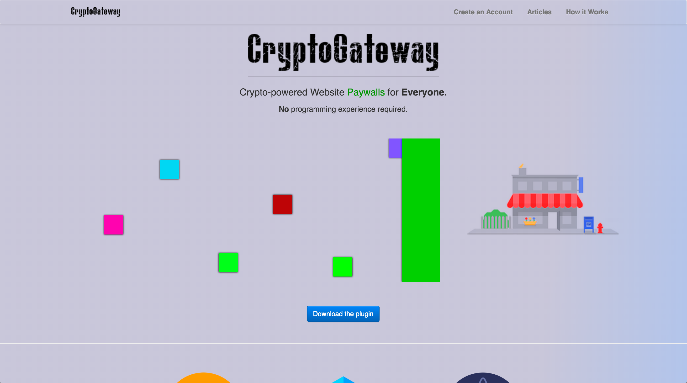
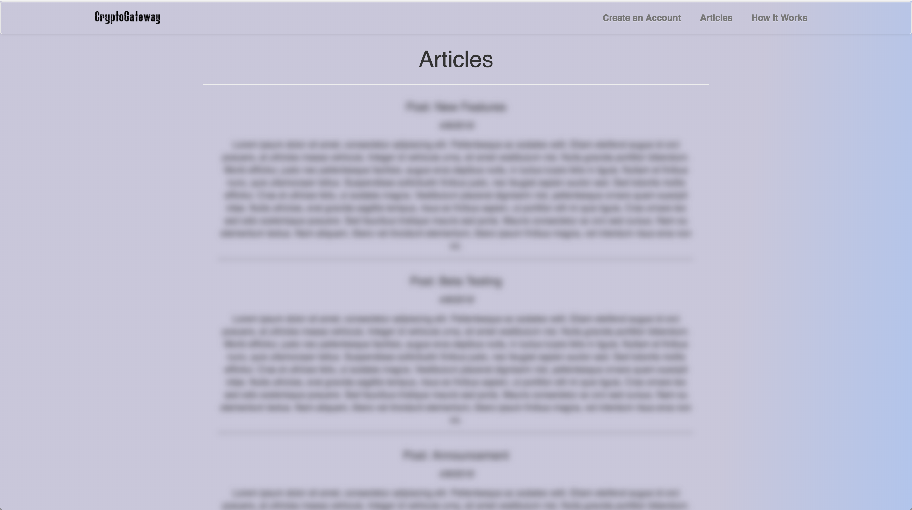

Cryptogateway
---

Crypto-powered Website Paywalls, powered by Cosmos and Bcoin.

Prototype Built for the the Crypto 4 Your Thoughts hackathon.

Pitch Deck here:
<a target="_blank" href="https://docs.google.com/presentation/d/1qWq337IARBoGINA7AzUMNWT9WyKPOtQ9Rwk_8fwi7qA/edit?usp=sharing">Slides</a>

**This README focuses on the prototype. Please see the <a target="_blank" href="https://docs.google.com/presentation/d/1qWq337IARBoGINA7AzUMNWT9WyKPOtQ9Rwk_8fwi7qA/edit?usp=sharing">pitch deck</a> for full spec and system architecture.**

### Concept

Cryptogateway is a free website plugin which wraps any of your desired content around a custom-priced cryptocurrency paywall.

For each customer, an account will automatically be generated which will store any funds sent to you by your website visitors. Each customer will be mapped to a unique address which is used to verify whether they have paid for website access or not. Once the user has paid, he or she will automatically be granted access to the content.

### Plugin Component (React)

<pre>
     Paywall
                    disabled={false} // defaults to false (enabled)
                    onClick={false} // defaults to false (auto blocks if false)
                    amount={.0001} // amount to pay for access
                         amountUnits={"Bitcoin"} // unit of payment
                         domain="www.cryptogateway.com" // domain of website
                         excludedUrls={["/"]} // will disable paywall on these url paths.
                         >
 </pre>

Steps for install:
<ol>
    <li>Create account on Cryptogateway.com - registering your domain name.
    <li>Install dependencies within <i>Paywall.js</i></li>
    <li>Selectively wrap your sensitive website content (or your entire site) with the Paywall.js component - adding the appropriate payment parameters needed for access.</li>

</ol>

### Screenshots

    <h3>Home Page</h3>
        
    <h3>Home page (with paywall applied)</h3>
        
    <h3>About page</h3>
        
    <h3>Articles page (more sensitive content)</h3>
        
    <h3>Article page (with paywall applied)</h3>
        

### Structure
* <b>/cryptogateway</b>: website
* <b>/server</b>: Lotion/Cosmos server - used for tracking IP address visits

### Dev Notes

Starting the website. 

From the */cryptogateway* folder:
<pre>
yarn && yarn start
</pre>

Starting the server.
From the */server* folder:
<pre>
yarn && node server.js
</pre>
